This is a transcript of the talk **["Handling OCD"](https://www.youtube.com/watch?v=OX_KcE8psww), by Dr. Reid Wilson.**

*The author of the transcript owns no right over the original content.*

--- 

[4:10]

So, I am going to talk pretty directly and simply to you, and I hope that you understand I realize how serious OCD is. I realize how long people suffer from this. I realize it's not a simple disorder to overcome but I'm going to talk pretty simply to you because I think there is a model of strategy that can help any of us begin to win this challenge that we have in front of us with OCD. So just bear with me and open your mind for the next 35 minutes, or 45 minutes, and you know you can throw all this away when I'm done, but if you can just consider that I might have something new that you haven't thought about I'd appreciate you just given that second.

[5:08]

So let's let's look at this first slide, we're talking about orientation towards doubt and distress and that, you know, the two things that we want to pay attention to I think more than anything else are these two things: doubt, uncertainty, not knowing, and then the distress that comes with it. Because that's how OCD takes us down. So if you look at this slide that we have up here you'll see, as we begin, pretty much everybody comes into treatment for an anxiety disorder, not just OCD, resisting. They are fighting something, trying to get rid of something - I hope I remember to come back to that expression - of trying to get rid of something. It's a very bad idea to approach the treatment and self-help of OCD by trying to get rid of something. So what we have here is resistance - you see this first column "It would be horrible if this happened. I hope it doesn't happen. It can't happen". That's that resisting position. If you move over just one notch "I really, I don't want this to happen". Again, if you look below that in that resistance which I'm at that side of that slide, is how anxiety disorders tend to beat you. In the middle you'll see "I can tolerate this occurring. I want this to happen. I choose it. That seems like such a crazy thought to have about OCD". And we're not saying "I want this terrible, awful consequence to happen". That's not what we're saying. We're saying "I want this doubt that I'm having. I can tolerate feeling uncertain. I can handle this anxiety I'm feeling right now, this discomfort, this distress". So we when we start to do treatment we really have two positions we can move to when we work with our clients, and the middle position is this position of permitting the symptoms. We say from the beginning when you are all better it's not going to be an absence of obsessions. Everybody has obsessions that pop up, so it's not having them go away. The position you get to in the end of your treatment when you're better is this one. "I can handle this occurring. I can tolerate this. I choose this". However that's a very difficult position to get to from a dead stop. So what I'm going to propose here is that we start self-help, we start treatment of OCD by moving all the way over to this position of provoking. "I'm going to go toward my symptoms". Now you know if you've done exposure treatment but that's what we do in exposure we go toward it, but here we're talking about a disposition, an orientation, an attitude, a stance. "I'm not going to go towards what I'm afraid of because I want to comply with my therapist instructions and be a good client. I'm not going to do it because I need to do that to get better". It's probably true you do need to do it to get better. But "I'm gonna do it because I want to do it" and when you get to- look at this last one: "I win if I continue to feel a sense of uncertainty". These last two positions are simply absurd to be thinking about.

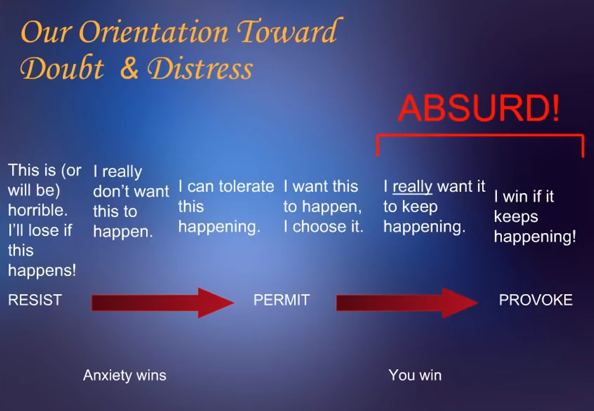

[9:07]

 Nonetheless, if we start thinking about OCD as a mental game, we're **playing a mental game** , and the reason we would want to talk about it like this is it's the most pragmatic way to think about treatment, or self-help. If we can orient like this and begin to play, what we want to begin to think about is that OCD is the challenger, not our enemy. It's what's coming to play this game against us as our challenger. So we- that's how you're going to hear me talk and you hear a lot of other people talk like that, you know "what is OCD doing to you" and so forth. But we're literally going to perceive it as we're going to personify it, and begin to work on it that way because it's going to give us the most power in the work.

[9:57]

Here's we want to think about. And the interesting thing about this is the challenger comes forward in this competition dressed in black and white stripes. **OCD comes in as the official in the game, instead of just the challenger, and it puts rules out that guarantee it will dominate you**. It would be like you and I going up to play one on one basketball, Neil, and you're naive about how to play basketball. And so I would say "look Neil this is how you play", you know, "when I've got that big orange ball in my hand, you are to drop your hands to your side and freeze until you see that ball go through that net. Once it goes through that net then you can move again. Now let's play basketball.'' Right? So that's what it's- let me just show you the rules and see if this isn't kind of how it goes. And if you do have OCD look at each one of these rules and see if you don't follow them in some way.

[11:11]

The first one is "**Be careful or you might cause some horrible problem**" or "**Be worried that you've already caused one**". So the first thing is has to go into this kind of fear status of "something is wrong". One of the things to say here is: this is what makes OCD so horribly painful to people. We're trying to work with people in treatment and they go "you want me to do what?", "you want me to not wash my hands,and risk bringing Salmonella home and causing my daughter's to become sick and maybe die? that's insane! what father in his right mind wouldn't take the extra four little minutes to wash his hands if by any chance whatsoever it would cause any kind of harm to their children if he doesn't wash" so OCD's got you over a barrel here when it starts to send this one out, and it sends this one out to everybody.

The second rule that OCD has is "**If a fearful thought pops up, you are to take it seriously**". And it makes totally good sense, we have a lot of very interesting research around that: the mind will do that,the first thought that comes up, the mind tends to think is the most relevant thought. If you were afraid to fly and you read some- you know, you start to board a plane and you have some little premonition that comes up, you could easily turn around and not get on the plane because of that. So when OCD gets you to take this fearful thought at face value, then it's going to have a lot more control over you.

Rule number 3: "**Feel absolutely certain**" (that you haven't caused or won't cause a problem). "Make sure your hands are clean enough. Be certain that you actually locked the door the front door, because somebody could break in and steal all your valuables, harm somebody in your family", so on and so forth. Here's that big one, right: "be absolutely certain". This is where it goes to get you. If we don't handle this one, if you don't make a change in your disposition about needing to feel certain, you will be dominated by the OCD, I can pretty much promise you that.

Let's build a rule number 4: "**Use your anxiety as a gauge**. **If you're feeling uncomfortable then there's still danger.**" This is very much what happens: OCD gets you to turn inside yourself, you're feeling agitated, you'll end up is what we call thought-feeling fusion. One of the things you can have is a fusion between an emotion and an action, not just thought-action fusion. You might have a client who when she would be driving if she felt some kind of sense that there was a bump in the road she would feel guilty, and her position was "why in the world would I keep driving after I felt that bump if I'm feeling guilty?" The only reason someone would feel guilty is if they've done something wrong. And so she and I worked a long time and just couldn't finish the work with her because she couldn't get off the dime about that thought, about "it's not about feeling guilty", it's about what we will talk about later on, but she felt stuck there. So we're going to have to do something around not using that "first thought that pops up is the most important", not use your anxiety as a gauge because these are the things that OCD uses to dominate you.

And then another huge one is "**Always act defensively**". And OCD requires you to do this in order to win. And that's part of what we want to think about in terms of the treatment. If OCD maintains itself in your life and dominates you by getting you to have a particular response, then if we can change your response you can begin to win. So in other words we what I would say to you is we don't want to pay attention to the symptoms, we want to pay attention to our response to the symptoms. So currently OCD is going to get you to back away, avoid situations that would produce these feelings in you, worry about it coming up again. You're gonna, as you back away, you're giving up territory. I'm going to show you a graph in a little bit just kind of illustrates that, and OCD takes more and more territory. And the only thing you figured to do to get rid of your obsession is to do a ritual, to do a compulsion, defensively.

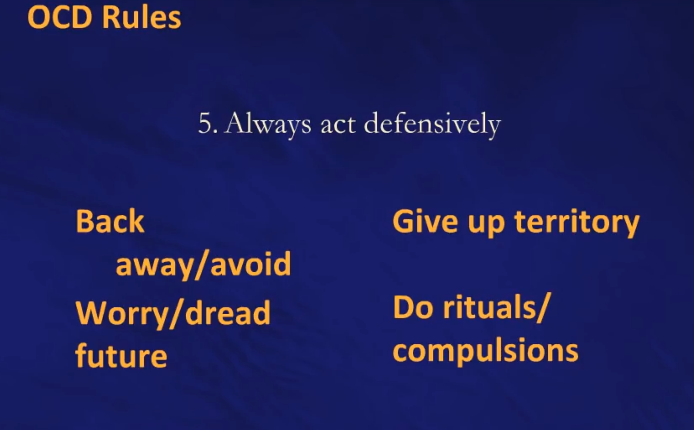

[16:45]

So we're going to have to do something about acting defensively all the time, because there's no way on earth you can win a competition if you only act defensively, if you only guard your goal, if you only protect your king and don't aggress into the territory of your challenger. You will remain trapped and OCD will love you because it will be able to dominate you when you do this. So we're going to have to create an offensive strategy. First thing we want to think about about an offensive strategy is you're going to feel uncertain. If you're going to have an offensive strategy, you're going to leave your safe territory, you're gonna leave your rules and regulations, you're going to step out into a place where you don't tend to go and become uncertain, and it's the last thing you want to do. Because you are set up by OCD to want to feel certainty. And now the treatment is going to ask you to do the thing that you want to do the least - and I'm sorry about that, it's not it's not how I would want it to go if we could do it some other way.

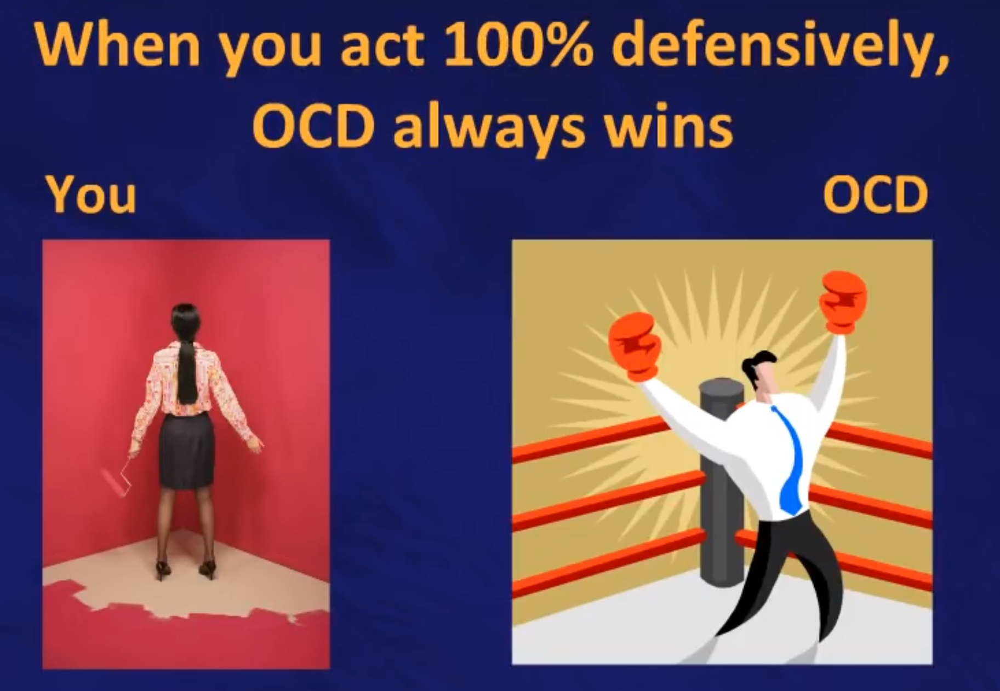

[18:03]

So let's look at the game board. What's the game board? look at the field. The game board is uncertainty, in nice big all caps letters because I want you to understand we want to keep our focus on uncertainty: that's the territory. You are not working on contamination, or being a child molester, or accidentally writing the wrong word on your check instead of your name, or or failing to lock the doors. Nothing about that. Those just stimulate your uncertainty. We are looking- for we want to go toward a generic state of uncertainty, and sit in it. That's the work. OCD dominates by taking your natural proclivity, everyone's natural tendency to worry when they feel a sense of danger. It is going to take your natural tendency to protect yourself through defensive moves and it's going to turn those on you by exaggerating them. And you know today I think the vast majority of people with OCD have it because it's a genetic disorder, but it doesn't matter that it's a genetic disorder. We know clearly that we can go in in a kind of behavioral or a cognitive approach, and modify something that got started through genetics.

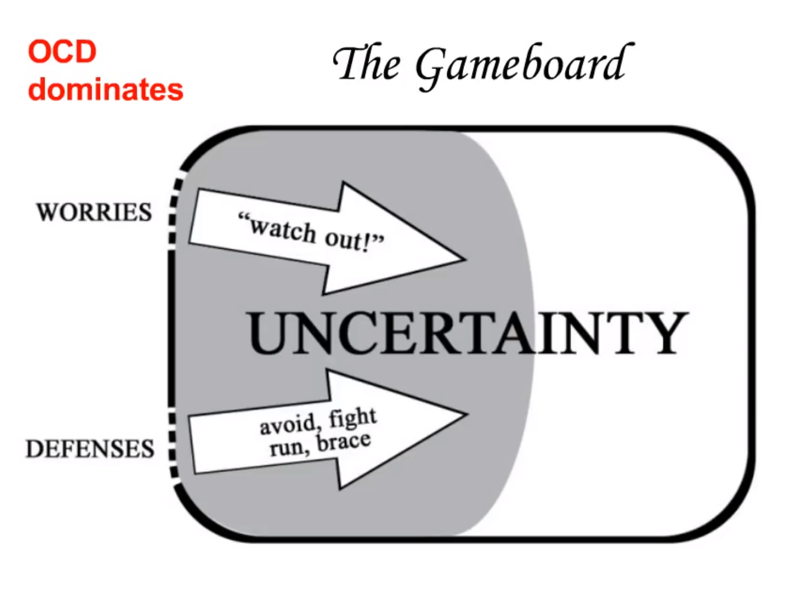

[19:43]

So here's where again- this a simple way to look at what we need to do do. Here is that territory of uncertainty and here's your moves on the right. We want to go in with your intentions. Now of course you can have a lot of intentions. One of your intentions is going to be to get back the life that you want to live, to be able to go back to school, to have- get off SSRI so you can get pregnant have a baby, do- some of you want to get married first, and that would be important, to take a job promotion, to be able to spend more time with your family without having a third of your mind preoccupied. Those are all very important intentions. But in the moment, and if you listen to me what you're going to hear from me over and over again is, this work is activated moment by moment. You wanna have a strategy for second by second, right. And the position you want to take is "I want uncertainty". There's that absurd stance again. Why do you want uncertainty? because OCD requires you to not want it. OCD throws you this thought/feeling in image, impulse, and not only do you have it, but you must not want it. That's how you win. It's not like it throws you the uncertainty, it throws you it and requires you to not want it. So you see just we flip the switch, we flip the tables on OCD, and move towards wanting it. "I want my life back. To get my life back I have to go through a tolerance of uncertainty". We have clear data across the anxiety disorders that intolerance of uncertainty is one of the major reasons people maintain the disorder. So we need to learn to tolerate that. And the second position is your resources, and again a lot of resources that you can use to overcome OCD, but the most important one is courage. Not confidence, everybody comes in wanting confidence, you know, somebody with social anxiety wants to get up in front of people and feel confident that their hands won't shake or their voice won't crack. Well that's fine but that's the outcome. The task is to be courageous, to get up in front of people, have my hands shake and be able to tolerate people noticing it. Here I've got to be able to be courageous, to take some stances and positions and actions, and not be sure what's going to happen next.

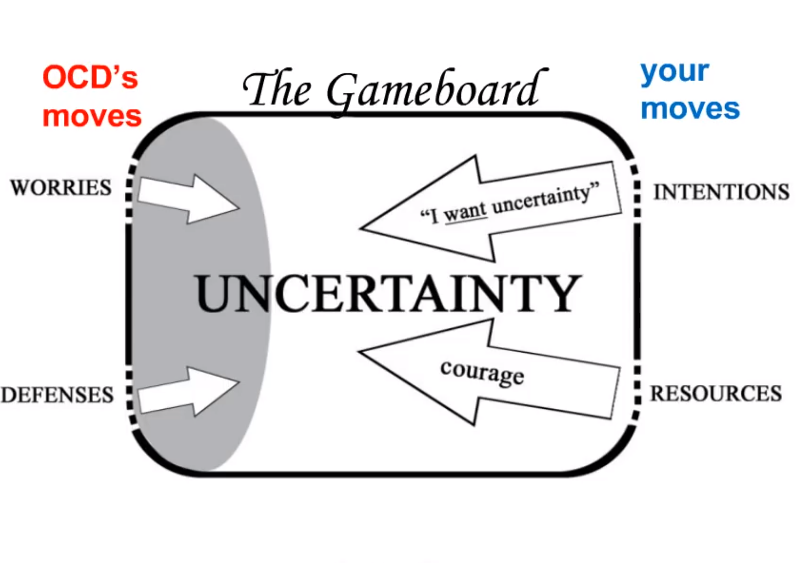

[22:33]

So let's look at what I would call the winning strategies.

First one is: "**Do NOT pay attention to your content**". That's the whole thing! content is like picking up garbage on the ground. You don't want to stoop over and pick up content. Content is the theme of your obsession. That I'm going to be contaminated and harm someone, that I will be rejected, that I will end up going to hell. The thing you want to understand is of course the content is related to you, the content is always going to be personal to you, because OCD picks a content that will get you. That's how as long as you maintain focus on the content it will continue to be. So we want to lift up we want to chunk up the work away from the specifics, because you those of you who had OCD for a while, you've had it for decades, you know that the themes of your OCD have shifted over the years, but what's remained consistent? that's we want to look at. You begin with a fear of washing, and then it come moves over to checking, or repeating, all those things. But it's all about a generic sense of uncertainty, and a generic sense of distress. That's where you and I want to move to.

The second position in the strategy is: "**When the obsession pops up** , **you accept it"**. And you don't accept it by by saying "Oh fine, maybe as I was walking in the corridor of the school, or in the mall, I brushed up against someone inappropriately and it's okay, I can accept that happening". No, we're not talking about that, about the content. "it's fine I just had a doubt that came up. There's my OCD producing a fearful doubt, and I expect that". So the reason you want to accept it is you accept it as nose to the moment, you don't accept it based on the content of the obsession. You have to get off the content. So you know if you say "If I don't wash my hands", maybe even "If I think this / read things", "I don't wash my hands, I'm gonna end up getting the flu". Well I'm I got a lot of things to, do I'm not interested in having ten days on my in bed, you know, because I'm a guy so we just lay in bed and say "Honey, could you take care of me". I can handle that. So to the degree that I think that thought is relevant. I can handle that. Where I want to shift to is "if I don't wash my hand I'm going to feel uncertain and anxious, or you know "I don't like feeling doubtful, I can cope with that". So that's the topic that we want to shift. "if I don't check the front door, someone's going to break in and steal everything in my house". I can handle that. But if it's "I don't check the front door I'm going to feel uncertain and distressed", I don't like that but I can keep going.

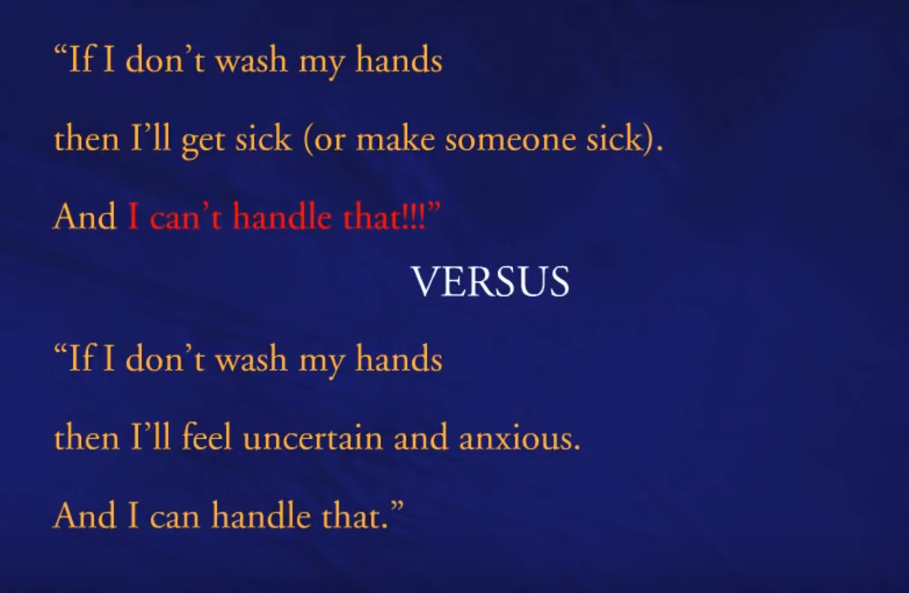

[26:26]

Number three: "**Want to make yourself uncertain**". Because we are going toward uncertainty to get better. The last thing OCD wants us to do. It's the opposite of what it wants. It's how the amygdala is going to learn. If later on somebody has a question about this and the amygdala, you just ask me in case I run out of time.

And then "**I WANT to stay anxious**". People with OCD have an intolerance of uncertainty, and they have anxiety sensitivity. Let's go toward both of those things.

And "**If it's necessary, then make rules & follow them**". If you've been taking showers for two hours every night for the last six years, then you can say "look, tonight I'm going to take a 20-minute shower". A 20 minutes is about four times as long as my shower. But if you've been taking one that's been terribly long, then to shift it down to 20 minutes: great! if you've been checking the front door 20 times before you leave in the morning, if you decide I'm going to allow myself to check it five times this week every time I leave, then, you know, five times still a little excessive, but boy it's a lot shorter than twenty times. It's a good way to start doing this work. So you make rules in order to get started with some of this stuff instead of having to go cold turkey for everything.

[28:03]

So if we back up again up one level of abstraction, to realize what we want to be working on when we're facing OCD, your job as the client, as doing the self-help, is to feel more anxiety and more uncertainty than you believe you can tolerate. Because we're talking about moment by moment and in the present moment, if you're about to do a practice, to expose yourself to your feared consequences, the way you know it's a good practice is you're going to be standing there just before you do it and you're going to be staying yourself "this seems like a really bad idea to be doing this". That's what it's going to look like in the moment. You've got to- you've got to steal yourself ahead of time, you've got to make some decisions; you’ve got to make some rules for yourself about how it's going to go, some new rules for yourself, before you step into these threatening situations. Because the closer you get to a threat, the less you're going to be interested in doing the work. So you've got to make a commitment ahead of time, work it out as a strategy, talk to whoever you need to to make those plans, and so forth. As you go in to do a practice and expose your practice as I would call the behavioral experiment, then operate like an automaton, operate like a robot, operate like an actor in a film, according to the script, because if you don't do that you're going to start to loosen your boundaries and have a very difficult time doing this work. The second thing that I want to encourage you to do is experiment and learn. You've got to do some experiments before I add up these things as you begin to practice so let me go out and do this action with this attitude and see what happens. "what can I learn from this?". And then I'm a cognitive- I'm a strategic therapist really, but I would fall under the category of cognitive therapy. So I focus all on beliefs. Over and over again I am driven by changing beliefs. And behavior change, as far as I'm concerned, should follow a belief change. Now of course sometimes you can have to do a new behavior that you don't believe in and don't cross, that's what we're talking about right here, doing something that you aren't sure is going to help you, but it's all about taking on, all this is what I'm talking about for this thirty five minutes with you, is to alter your belief about what it takes to get better. Because I think if you can get you belief lined up, it's going to be much easier to do the practice over and over again. Then you're going to repeat your action what we would call - you know to habituate or two to get conditioned to the response, but let's get a belief in place and then start repeating those actions instead of waiting and repeating actions over and over again so that I end up having an inside.

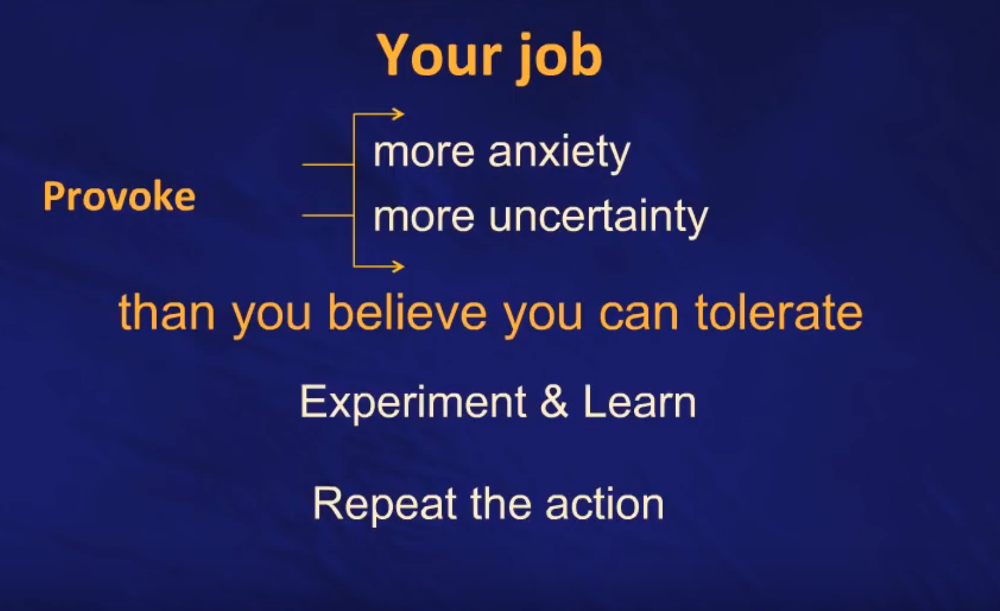

[31:25]

Let's put the inside up front. So here we are on this particular slide number 24, people are going to start with like I said up to here at the very top: "I want to get rid of <whatever, that feeling or thought is>". We want to be moving to the position of "in the end, I'm willing experience this feeling or thought". In the initial time of treatment, it's I'm going to go look for it. That's that's a provocative position, and if you want to go to the graduate level, you want to do the extra credit work, you're going to be more aggressive with OCD and you're going to talk to OCD, and and you're going to say hey come on give me a best shot. You want to take me down take me down. I'm taking my life back and if you want to get me you go ahead sucker I'm going forward. That's a pretty aggressive stance that boy it's a great way to move a lot quicker. So you can't get better from this position. You want to end up here. You start here. And then if you want to be aggressive you go there.

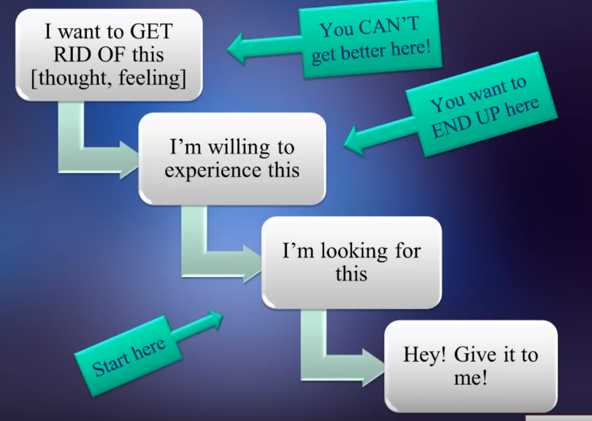

[32:38]

As I said it's moment by moment, the concept is absorption versus dissociation. You're going to have an obsession it's going to pop up. We're not trying to extinguish the thought popping up. We want to bring a parallel thought up next to it. That is the therapeutic thought, right. So "Oh my god this is terrible I shouldn't do this" and then "Wait a minute there's my OCD talk" and "Let me just stay here and take this action like I worked out, and let's see what happens". So we want to have both: you can have parallel thoughts coming up and then you want to move over to that therapeutic stance. How do I make this work, you know, if you take any advice from what I'm saying tonight, if you go out and try something tomorrow you want to be saying "Okay now what it is that Reid was saying, I go toward this and want it". So you focus on that, and when you do that this is a zero-sum game. You bring consciousness powerfully to trying to learn this protocol, even if you're a clumsy student of the work, by default, the fearful thoughts will start to fade away. The last thing you want to do is to make those two contradicting thoughts "I don't want this / I want this" into parallel equals, then you just argue with yourself and you know this one too well, right? so it's you know "How to apply the principles right now" versus "How do I get rid of my doubts and distress". You focus on one and it spontaneously reduces the other.

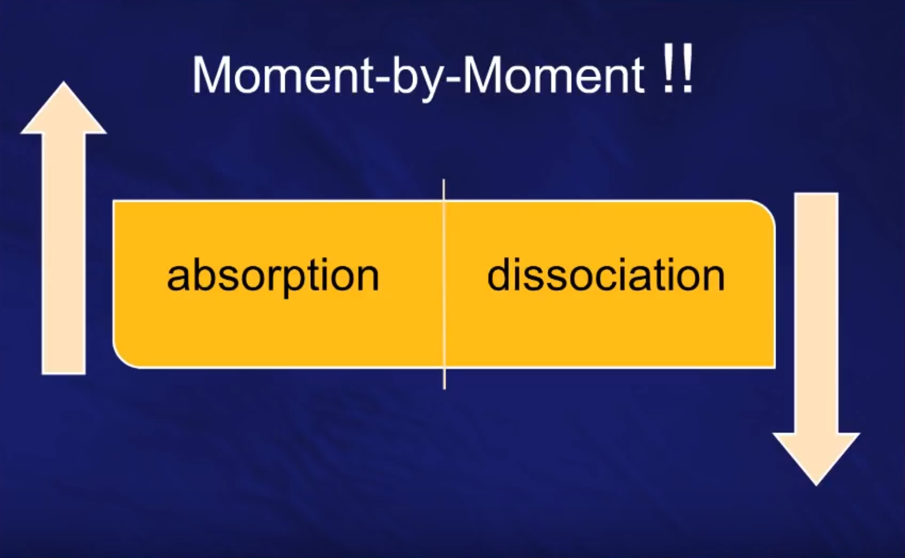

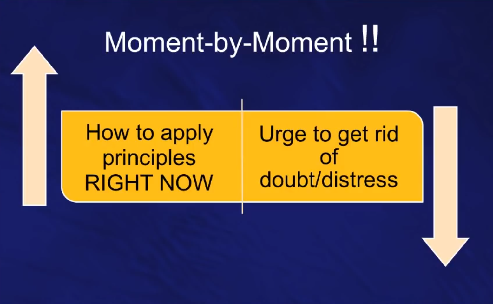

[34:30]

I encourage you to go to a position of being awkward clumsy feeling inadequate, courageously pushing into this territory. If you think about it, anytime we've learned anything new, whether it's been an athletic skill, or a barn language, or calculus and physics, in the beginning you feel awkward and clumsy and insecure, and you're just uncertain, but you have to stay with that, that beginner's mind, and then eventually by staying with it you end up catching on and learning it and mastering it. So people who start feeling awkward and clumsy and uncertain and then stop never can learn. So we want to bring your attention over there to having those feelings versus thinking about harming someone that you're going to contaminate someone, that you've made a terrible mistake, right? where are you bringing your attention?

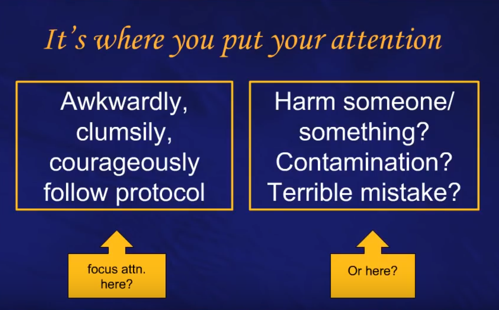

[35:38]

Now in the moment here's how it might sound: now here's what going to happen automatically here's just an example: "Did I do something wrong? There's my obsession. Oh no, I need to find out, there's my urge to do my compulsion". These two are automatic, that's what you want to consider. Those are just going to pop up. I'm not going to not kind of try to get rid of them because what's the point? don't try to get rid of those, those are going to come. We're going to throw those away, we're going to let OCD generate those thoughts in you. What's the next thought to have? The next thought to have, kind of- again, lots of things you can say, let me just give you an example what to say. You don't have to quote, this it's just a reasonable facsimile. "good, just had an obsession. I don't want to answer the question is something going to go wrong. I'm not going to answer that because I'm trying to remain uncertain, right, that's my job. It's to not know". That's the work. Now, as soon as you decide to remain uncertain, how are you going to feel? you're going to feel scared. Of course you're going to feel scared because going toward the ritual, going toward getting rid of that thought is a defense. Now we're asking you to no longer use that defense, you're going to feel vulnerable and defenseless, and you're going to feel scared. Now what in the world in this protocol, you see over here on the right that little picture, that little graphic, that's a film strip and that's indicating, frame by frame, moment by moment, this is how I want to think. So, when I'm scared what the world I want to say to myself at that moment? "Good, I'm looking to be anxious too, I want to be scared. They are the two pieces. I want to be uncertain, and I want to be uncomfortable". That's the work, over and over and over again.

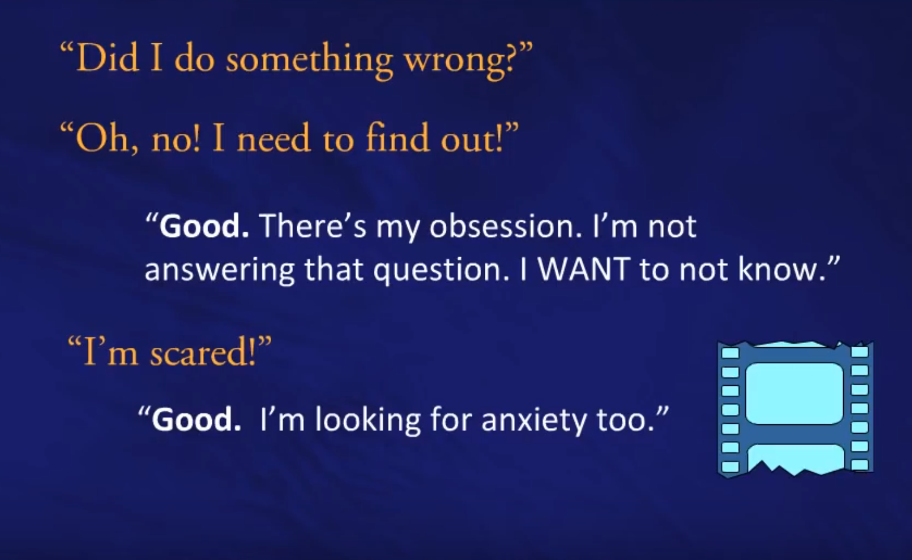

[37:56]

You can think a little bit about Hebb, Hebb created this law and here's what it says: "Neurons that fire together wire together". What that means is, if we can think about it in this way, "When I step into a threatening situation, and I say to myself, but we got neurons firing off because I am anxious and scared and uncomfortable, and when those neurons fire off I want to bring up a message to myself like I can handle these feelings, this is what I want, I'm going for this, give me your best shot". Because when you start having those neurons fire at the same time, and you do that repeatedly, then they begin to wire together, and you don't have to work so hard at it. So we're shooting for that neurologically. The other thing that's going to happen, I think, if, you know, I can convey it well enough or someone else can convey it well enough to you, you can start doing it, is that you'll get a result that's different than you've gotten before. And that you can go "Hey, wait a minute, I tried this and look what happened". So I am asking you just rise up, get up a level of abstraction to generic uncertainty, generic distress, as your best way out of this really terrible, terrible mental health disorder". So if you were going to go out and start doing this stuff, here's how I would suggest to do it: as you begin to do your practices, as you think about stepping into a situation that would provoke your uncertainty and distress, then these four questions up here might be ways to kind of stir yourself up and focus your attention: - Can I create some doubt here? What I have underlined is "create" means "Can *I* take control?". If you create doubt, you are in control of that moment. "I want to go toward and create the doubt, because as I wait for it to come and be afraid of it, I am the victim, and I'm going to move from being the object in this game to the subject in this game". - Can I practice being willing to feel that kind of uncertainty once I generate? That's what I want to do. "can I do that now? can I tolerate? can I sit with this anxiety?" That third question: - Can I invite OCD to make it stronger? And this is kind of a twist that I tend to do on the traditional workers. So we're looking for habituation: frequency, intensity, duration of exposure. I'm going to step into those threatening situations, here's again we're at the end so I'm giving you advanced suggestion here is that "I'm going to step into the situation. I'm going to ask OCD to make my distress stronger, or my uncertainty stronger. I'm going to ask OCD to see if they can make it. Look, please stick around. Make my uncertainty stick around. I'm going to go back to whatever I want to focus on in that task, and let it do that work." and if we're playing the game you know let's the score points. Here's how you score a point. And the reason I do even talk to you about scoring points is when you score a point you work in the protocol. So if you can come up with some messages for yourself that help reinforce going toward what it is you've been avoiding, then you want to be saying those in the moment, so you can line up your consciousness with the work. So you find something to say, some reasonable facsimile of these things. "I'm willing to have this feeling", "I can handle not knowing", "I can take the hit", and "I want these feelings to stick around". Any of these kinds of things. "I want to feel intense". Of course you don't- you know, I'm built for comfort, I'm not built- I like to be lazy and so forth. But if I've got to get something handled I want to step up and get into it and get going. So I don't want to back away, I want to go toward it. And if I have to feel- you know, you're not going to like feeling really anxious, but if that's the key to get you through to the other side of OCD- OCD just wants you to get spooked and run away. You're going to have to have a period of time where it starts getting you and you take the hit and keep moving.

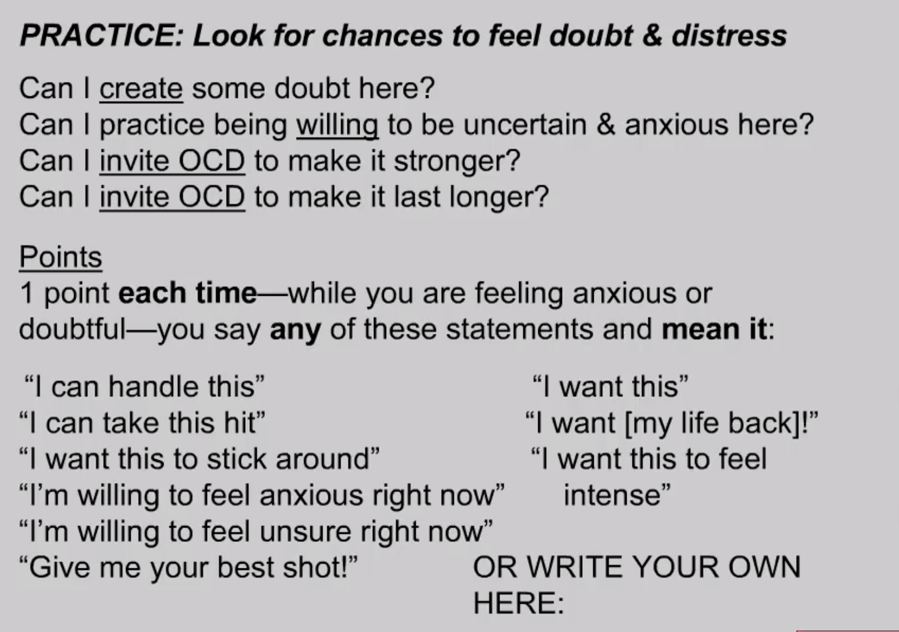
